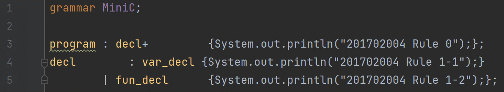
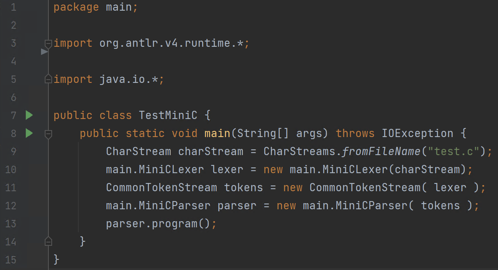

# 컴파일러개론 hw02 - 201702004 김해람

## main

* ANTLR 4.7이후로 ANTLRFileStream은 deprecated되었으므로 CharStream객체로 대체해준다.
	* CharStreams.fromFileName()메소드를 이용해 루트에 있는 test.c파일로 CharStream객체를 생성한다.S
* 이후 생성한 CharStream객체를 이용해 MiniCLexer객체를 생성한다.
* 생성한 MiniCLexer객체를 통해 토큰들을 받아낼 CommonTokenStream객체를 생성한다.
* 생성한 CommonTokenStream객체를 이용해 MiniCParser객체를 만들어준다.
* 이후 parser.program()을 이용해 주어진 test.c파일을 분석한다.
- - - -
## MiniC.g4

* .g4파일을 구성하는 규칙들마다 {}안에 java 코드를 넣어서 매칭될때마다 해당 코드가 실행되게 한다.
* {}안에는 `System.out.println("201702004 Rule <rule number>");`를 넣어 어느 규칙이 매칭되었는지를 화면에 출력하도록 한다.
- - - -
## 느낀점
* .g4파일에 규칙을 지정해준 뒤에 이것을 이용해 java 코드가 생성되고, 이것을 이용해 주어진 파일의 어휘분석 및 구문분석을 할 수 있는 것이 신기했다.
