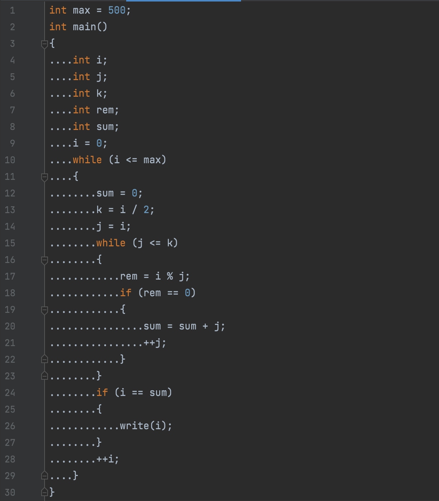

# 컴파일러개론 hw03 - 201702004 김해람

## 해결방법
### Nested Indent
* 코드의 블럭에 관한 부분인 compound_stmt을 처리해 주었다.
* compound_stmt로 진입하는 시점인 `enterCompound_stmt()`메소드에서 인덴트의 레벨을 뜻하는 `level` 프로퍼티 값을 1 증가시키고, 빠져나오는 시점인 `exitCompound_stmt()`메소드에서 `level`프로퍼티의 값을 1 감소시키는 것으로 각 블럭에 대한 인덴트 레벨을 계산해주었다.
* 각 레벨에서는 레벨 1당 4개의 마침표를 찍은 문자열을 추가해 인덴트를 표시하였다.
* 여닫는 중괄호에서는 변경된 인덴트 레벨이 아닌 변경 전의 인덴트 레벨을 따라가므로 그에 맞게 인덴트 레벨을 수정해가며 출력을 하였다.
### Block
* 중괄호는 개행 이후 표시되어야 하므로 compound_stmt의 시작과 끝에 개행을 넣어주었다.
* 따라서 중괄호가 표시되지 않는 if, while문에는 개행이 이루어지지 않고 한 칸 공백을 두고 문자열이 등장한다.
### ParseTreeProperty
* 자식노드에서 생성된 값을 부모 노드에서 사용하기 위해 자식 노드에서 `ParseTreeProperty.put()`메소드를 통해 생성된 결과물을 트리에 삽입한다.
* 이후 `ParseTreeProperty.get()`메소드를 통해 부모 노드에서 사용하는 방식으로 구현하였다
* Non-terminal의 경우에는 자식노드가 있기 때문에 `ParseTreeProperty.get()`메소드로 값을 호출하여 사용할 수 있었지만, Terminal의 경우에는 자식노드가 없기 때문에 `ParseTreeContext.getText()`메소드를 이용하여 Terminal의 문자열을 바로 활용하였다.
### 전체적인 구조
* 루트 노드에서부터 리프 노드까지 깊이 우선 탐색을 하게 된다.
* 리프 노드까지 내려간 다음에는 더 이상의 자식이 없으므로 현재 Terminal 문자열을 처리하여 부모에게로 올라가고, 부모는 해당 값을 호출하여 추가적인 처리를 거친 뒤 또다시 부모에게로 넘기는 방식이다.
* 위와 같은 과정을 거친 뒤에 루트노드까지 도달하게 되면 입력 문자열 잔체에 대한 처리가 이루어지게 되고, 이것을 파일에 출력하는 것으로 모든 과정이 종료된다.
- - - -
## 실행결과
### 입력 파일 (test.c)
```
int max = 500; int main() { int i; int j; int k; int rem; int sum; i = 0; while(i <= max) { sum = 0; k = i / 2; j = i; while(j <= k) { rem = i % j; if(rem==0) { sum = sum + j; ++j; } } if(i == sum) { write(i); } ++i; } }

```
### 출력 파일 ([HW3]201702004.c)

